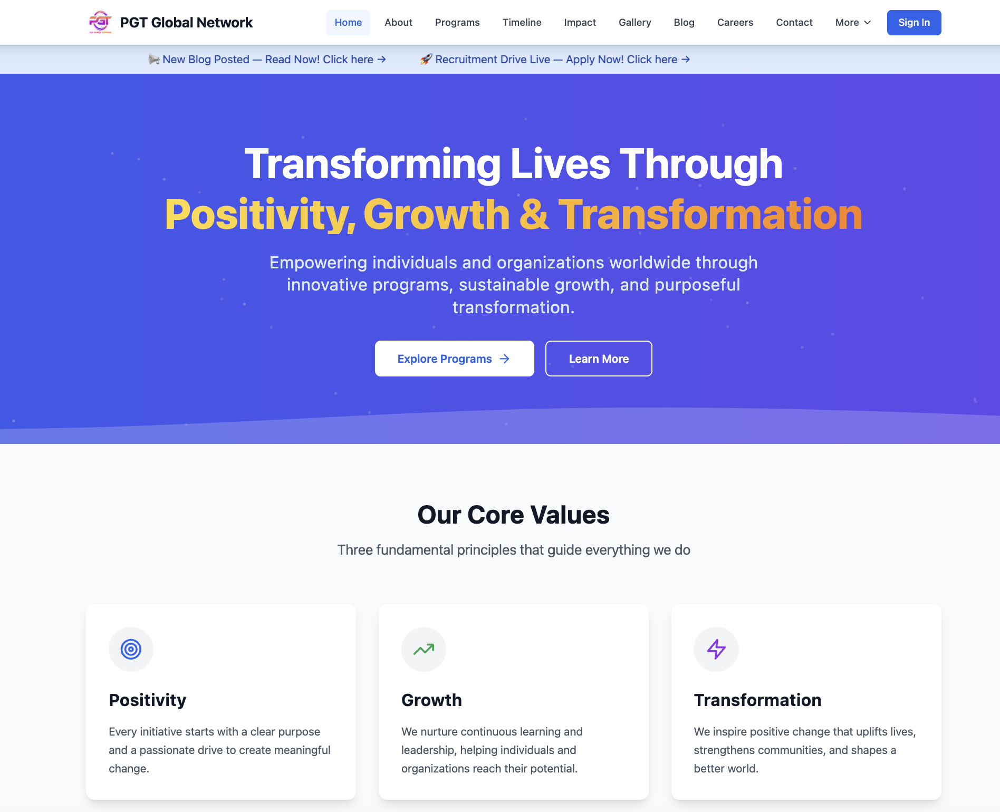
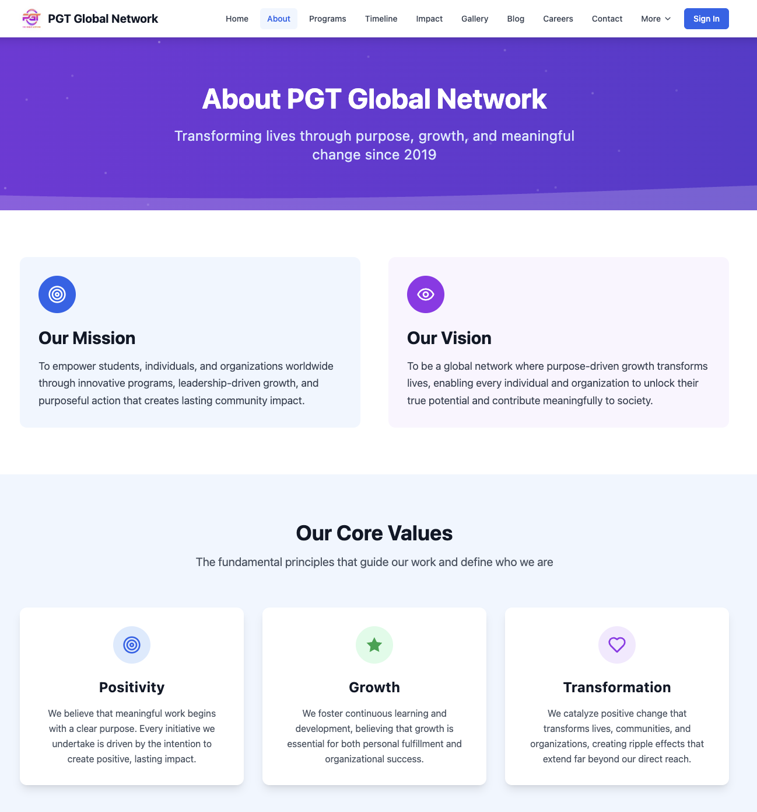
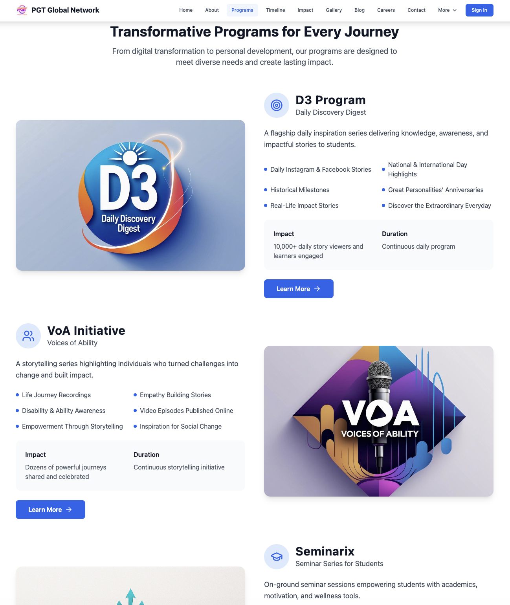
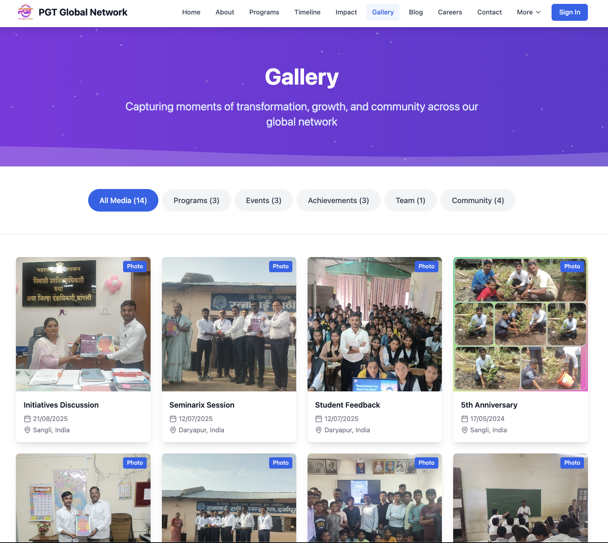
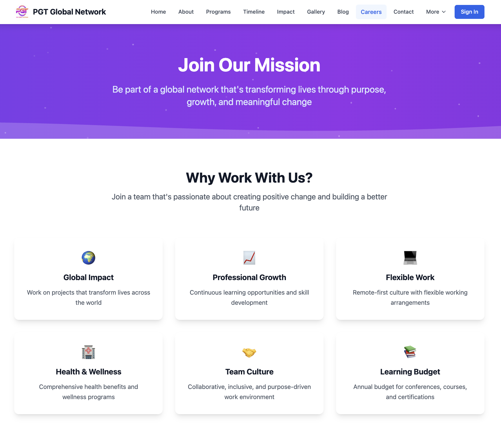
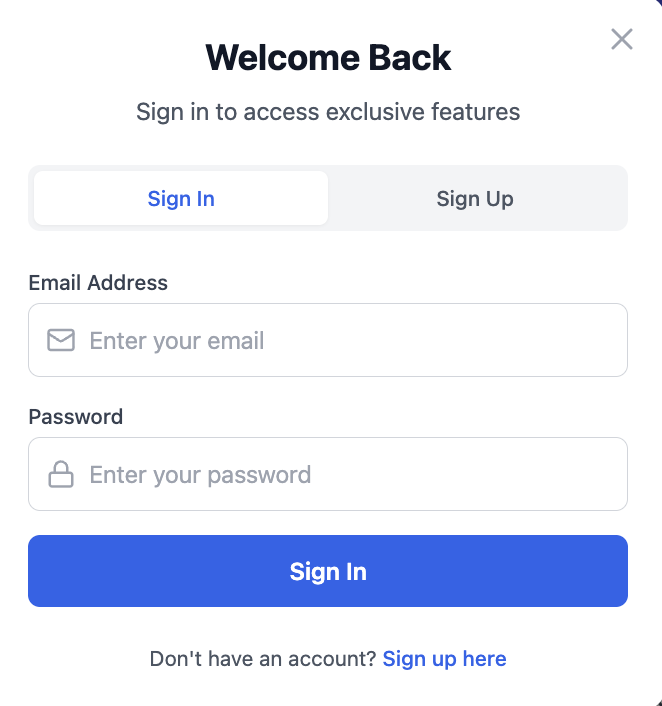
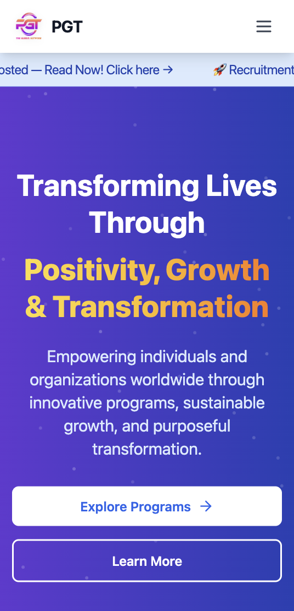
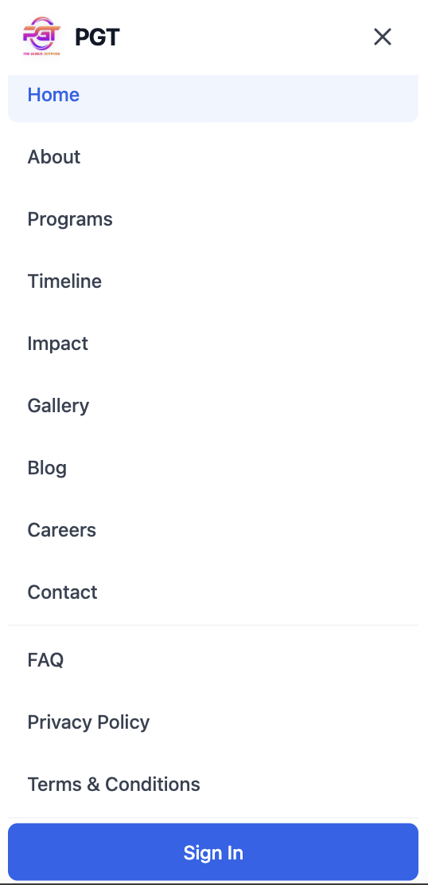

# 🌍 PGT Global Network

<p align="center">
  A modern platform empowering mentorship, careers, innovation, and community-driven growth.
</p>

<p align="center">
  
  
  
  
  
  
</p>

<p align="center">
  
</p>

<p align="center">
  Transforming Lives Through Purpose-Driven Growth
</p>

<p align="center">
  <a href="https://www.pgtglobalnetwork.com/">Live Website</a> •
  <a href="#-getting-started">Getting Started</a> •
  <a href="#-contribution-guidelines-gssoc">Contribute</a>
</p>

---

## 🌟 Open Source Program

This repository is actively maintained under GirlScript Summer of Code (GSSoC) for collaborative open-source contributions.

All changes are reviewed before merging into the official production platform.

---

## 📚 Table of Contents

- [📌 About Project](#-about-project)
- [⭐ Key Highlights](#-key-highlights)
- [🌐 Live Demo](#-live-demo)
- [✨ Features](#-features)
- [🛠️ Tech Stack](#️-tech-stack)
- [📸 Screenshots](#-screenshots)
- [📁 Project Structure](#-project-structure)
- [🚀 Getting Started](#-getting-started)
- [🤝 Contribution Guidelines](#-contribution-guidelines-gssoc)
- [🚀 Roadmap](#-roadmap)
- [📝 License](#-license)
- [💬 Support](#-support)

---

## 📌 About Project

A modern, responsive website for PGT Global Network built with React, TypeScript, and Tailwind CSS. This platform showcases our programs, impact, and mission to transform lives through purpose-driven growth.

### 🌍 Why PGT Global Network?

PGT Global Network is designed to empower students, professionals,
and communities through mentorship, innovation, impactful programs,
and purpose-driven transformation. The platform creates opportunities
for growth, collaboration, and meaningful social impact worldwide.

---

## ⭐ Key Highlights

- 🌍 Global mentorship and growth-focused platform
- 💼 Career opportunities and internship portal
- 📰 Interactive blogging and storytelling system
- 📱 Fully responsive modern UI experience
- 🤝 Open-source collaboration under GSSoC

---

## 🌐 Live Demo

**Production Site:** [https://www.pgtglobalnetwork.com/](https://www.pgtglobalnetwork.com/)

---

## ✨ Features

- 📰 Interactive blog platform with search, categories, and community engagement
- 📱 Fully responsive design for desktop and mobile devices
- 🎯 Dedicated programs showcase with detailed information
- 🖼️ Media gallery for events and community activities
- 💼 Career portal for opportunities and recruitment
- ⚡ Built using React, TypeScript, Vite, and Tailwind CSS
- 🌙 Clean modern UI with smooth user experience
- 🔐 Secure authentication system using Supabase
- 🔄 Reusable component-based architecture
- ☁️ Backend integration with Supabase services

---

## 🛠️ Tech Stack

### Frontend
- React 18
- TypeScript
- Tailwind CSS
- React Router DOM
- Framer Motion

### Backend & Services
- Supabase

### Development Tools
- Vite
- ESLint

### Deployment
- Vercel

---

## 📸 Screenshots

### 🏠 Homepage
<p align="center">
  
</p>

### ℹ️ About Page
<p align="center">
  
</p>

### 🎯 Programs Page
<p align="center">
  
</p>

### 🖼️ Gallery Section
<p align="center">
  
</p>

### 💼 Careers Page
<p align="center">
  
</p>

### 🔐 Authentication System
<p align="center">
  
</p>

### 📱 Mobile Responsive Design

#### Mobile Homepage
<p align="center">
  
</p>

#### Mobile Navigation
<p align="center">
  
</p>

---

## 📁 Project Structure

```bash
src
├── components
├── pages
├── contexts
├── hooks
├── lib
├── App.tsx
└── main.tsx

public
├── screenshots
└── assets
```

---

## 🚀 Getting Started

### Prerequisites

- Node.js 18+
- npm or yarn
- Git

### Installation

```bash
git clone https://github.com/pranav-gujar/PGT_Global_Network_GSSOC.git

cd PGT_Global_Network_GSSOC

npm install
```

### Environment Setup

Create a `.env` file in the root directory:

```env
VITE_SUPABASE_URL=your_supabase_project_url
VITE_SUPABASE_ANON_KEY=your_supabase_anon_key
```

### Run Development Server

```bash
npm run dev
```

Open your browser and visit:

`http://localhost:5173`

### Production Build

```bash
npm run build
npm run preview
```

---

## 🤝 Contribution Guidelines (GSSoC)

We welcome contributions from developers participating in GirlScript Summer of Code (GSSoC).

### Steps to Contribute

1. Fork the repository
2. Create a feature branch
3. Make your changes
4. Commit your updates
5. Push to your fork
6. Create a Pull Request

Please read the `CONTRIBUTING.md` file before contributing.

---

## 🚀 Roadmap

- [ ] Multi-language support
- [ ] Event management system
- [ ] Newsletter integration
- [ ] Advanced search functionality
- [ ] Mobile application
- [ ] Payment gateway integration

---

## 📝 License

This project is licensed under the MIT License - see the [LICENSE](LICENSE) file for details.

---

## 💬 Support

For support, suggestions, or collaboration:

- 📧 Email: office@pgtglobalnetwork.com
- 🌐 Website: https://www.pgtglobalnetwork.com/

---

<p align="center">
  Built with ❤️ by the PGT Global Network Team
</p>

<p align="center">
  Empowering growth through mentorship, innovation, and global opportunities.
</p>